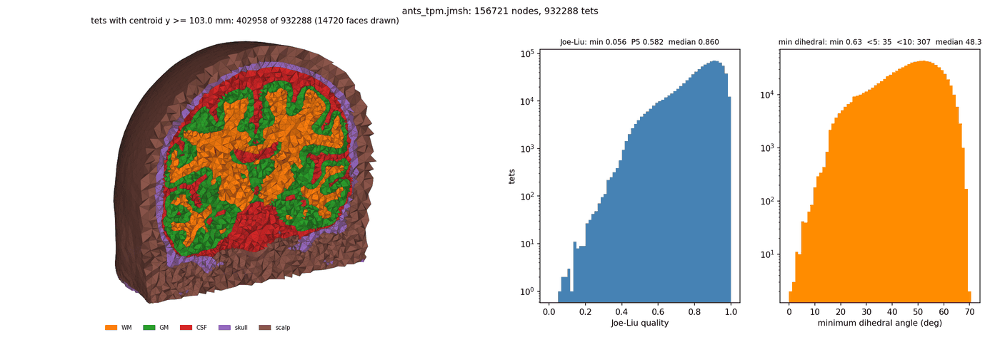
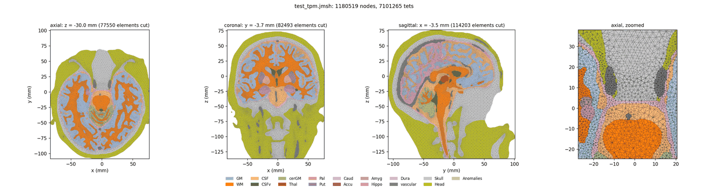
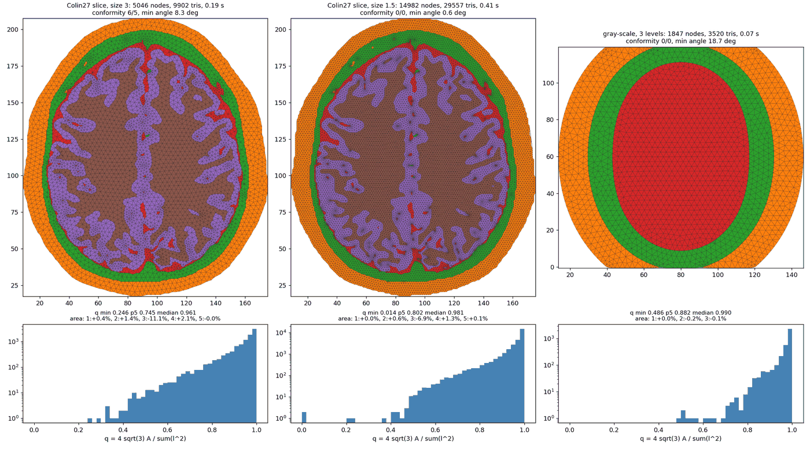

# trussnet - Fast, Conforming Tetrahedral Meshes from Images

[](https://github.com/fangq/trussnet/actions/workflows/ci.yml)
[](https://github.com/fangq/trussnet/actions/workflows/wheels.yml)
[](#license)

- **Copyright**: (C) Qianqian Fang (2026) \<q.fang at neu.edu>
- **License**: GNU General Public License, version 3 or later
- **Version**: 0.5.0
- **GitHub**: <https://github.com/fangq/trussnet>

**Give it a segmented image, get back a tetrahedral mesh.** `trussnet` turns a
multi-label volume, a gray-scale image with iso-levels, or a tissue-probability
map into a conforming tetrahedral mesh: every tissue gets its own elements, the
surfaces between tissues are shared exactly, and the outside is never meshed. A
2-D image gives a triangle mesh the same way.

It is fast because the heavy part runs on the GPU: the nodes are placed by a
spring (truss) relaxation — the moving-particle idea of DistMesh — as OpenCL
kernels, and the exact Delaunay tetrahedrization is built on the GPU too. A
brain head model with a million elements takes seconds, not minutes. No GPU? It
runs, unchanged, on the CPU.

> **Who it's for:** anyone who builds finite-element or Monte Carlo models from
> medical or microscopy images — brain and head models for optical, EEG/MEG or
> electrical simulations, small-animal atlases, phantoms. If you have used
> **iso2mesh**, **brain2mesh** or CGAL's mesher, the inputs and outputs will look
> familiar; the difference is that `trussnet` takes the segmentation (or the
> probabilities) directly and never needs a surface mesh first.

<p align="center">
  
</p>

---

## Contents

- [Highlights](#highlights)
- [What it can mesh](#what-it-can-mesh)
- [Installation](#installation)
- [Getting started](#getting-started)
  - [Command line](#command-line)
  - [MATLAB and GNU Octave](#matlab-and-gnu-octave)
  - [Python](#python-1)
- [Controlling the mesh](#controlling-the-mesh)
- [Output](#output)
- [Command-line reference](#command-line-reference)
- [Performance](#performance)
- [How it works](#how-it-works)
- [Troubleshooting](#troubleshooting)
- [For developers](#for-developers)
- [License](#license)
- [Credits and links](#credits-and-links)

---

## Highlights

- **Straight from the image.** A label volume, a gray-scale image and its
  thresholds, or a 4-D tissue-probability map — no surface extraction, no
  surface repair, no boolean operations first.
- **Conforming by construction.** Neighbouring tissues share their interface
  triangles; nodes sit on the interfaces and on the curves where three tissues
  meet. The mesh is checked and repaired until it conforms.
- **Any number of tissues.** Two, six, seventeen — the 18-class siamize brain
  segmentation meshes with its deep grey nuclei as separate regions.
- **Fast on a GPU, correct without one.** The relaxation and the Delaunay
  tetrahedrization run as OpenCL kernels; the result is exactly the same
  Delaunay mesh the CPU code builds, and the CPU path is always there.
- **Good elements.** Graded sizes, a radius-edge bound (`-q`, as in TetGen),
  sliver removal and smoothing: a median Joe-Liu quality near 0.88, and fewer
  than one element in ten thousand below 10° on brain models.
- **Sizes where you want them.** A default size, per-tissue sizes, automatic
  refinement at curved and thin structures, or your own sizing field.
- **Deterministic.** The same input gives the same mesh, byte for byte, on the
  GPU or the CPU.
- **Three front ends, one engine.** A command-line program, a MATLAB/Octave
  function and a Python package, all calling the same code.

---

## What it can mesh

| Input | What trussnet does | Example |
|---|---|---|
| **Label volume** (integers; 0 = outside) | a region per label, with shared interfaces | a segmented head, an atlas |
| **Gray-scale volume** and thresholds | the iso-surfaces between the levels become the interfaces, at sub-voxel accuracy | a sensitivity map, a CT image |
| **Tissue-probability map** (4-D: one channel per class) | labels from the most probable class; "background" or "air" channels, or `1 - sum`, are the outside; enclosed air pockets are filled | SPM tissue maps, siamize or other network outputs |
| **2-D image** (labels or gray-scale) | a triangle mesh with the same guarantees | a slice, a histology image |

Files: NIfTI (`.nii`, `.nii.gz`) and JNIfTI (`.jnii` text, `.bnii` binary), 3-D
or 4-D. The MATLAB and Python front ends also take arrays directly.

<p align="center">
  
</p>

---

## Installation

### Python

```sh
pip install trussnet
```

Wheels are built for Linux (x86_64), macOS (Apple Silicon and Intel) and
Windows (x64), Python 3.9–3.13. They use a GPU through the OpenCL driver you
already have (NVIDIA, AMD, Intel or Apple) and fall back to the CPU if there is
none. Until the first release is on PyPI, install from a checkout:
`pip install ./pytrussnet`.

### MATLAB and GNU Octave

Build the MEX file from a checkout (see [Build from source](#build-from-source)),
then

```matlab
addpath('/path/to/trussnet/matlab');
```

Every CI run also produces prebuilt Linux MEX files (the repository's *Actions*
tab, artifacts `trussnet-matlab-mex-linux` and `trussnet-octave-mex-linux`).

### The command-line program

Every CI run produces standalone binaries for Linux, macOS and Windows
(artifacts `trussnet-linux-x86_64`, `trussnet-macos-14`, `trussnet-windows-x64`).
They need no installation; an OpenCL driver is optional.

### Build from source

You need a C++11 compiler (GCC, Clang or MinGW-w64) and CMake 3.12 or newer.
Optional: an OpenCL SDK for the GPU path (`ocl-icd-opencl-dev` and
`opencl-headers` on Debian and Ubuntu) and OpenMP (`libomp` on macOS).

```sh
git clone https://github.com/fangq/trussnet.git
cd trussnet
make                 # the command-line program: build/trussnet
make check           # ... and run its tests
make bindings        # also the Python module and the MATLAB / Octave MEX
make test            # ... and all of their tests
```

| CMake option | Default | What it does |
|---|---|---|
| `TN_USE_OPENCL` | ON | the GPU path (OFF: CPU only, no OpenCL needed) |
| `TN_BUILD_PYTHON` | OFF | the Python module |
| `TN_BUILD_MATLAB_MEX` | OFF | the MATLAB MEX (set `Matlab_ROOT_DIR` if MATLAB is not on the `PATH`) |
| `TN_BUILD_OCTAVE_MEX` | OFF | the Octave MEX (needs `mkoctfile`) |
| `TN_STATIC_LINK` | OFF | a self-contained binary (static C++ runtime; fully static with MinGW) |
| `TN_BUILD_TESTS` | OFF | register the command-line tests with `ctest` |

---

## Getting started

### Command line

```sh
# a label volume, 2 mm elements, on the GPU
trussnet -i head_labels.nii.gz --size 2 --gpu -o head.jmsh

# finer elements in labels 3 and 4
trussnet -i head_labels.nii.gz --size 3 --lsize 3:1.5,4:2 --gpu -o head.bmsh

# a gray-scale image, meshed at three iso-levels
trussnet -i intensity.nii.gz --thresholds 0.2,0.5,0.8 --size 2 -o levels.jmsh

# a tissue-probability map (the 18 siamize classes merged to SPM's six)
trussnet -i tpm.bnii --tpm-spm6 --gpu -o head.jmsh

# no data at hand? a built-in phantom
trussnet --shape shells --dim 96 -o shells.jmsh
```

Every run ends with a summary: the mesh size, the conformity checks, the volume
error of each tissue and the element quality. `-v` also prints the progress.

### MATLAB and GNU Octave

```matlab
[node, elem, face, info] = trussnet(vol, 'size', 3, 'gpu', 1);

% options as a struct; per-tissue sizes; gray-scale levels
opt = struct('size', 3, 'lsize', [0 1.5 2], 'reratio', 2);
[node, elem, face] = trussnet(vol, opt);
[node, elem, face] = trussnet(img, 'thresholds', [0.2 0.5 0.8], 'size', 2);

% a file (NIfTI / JNIfTI, including 4-D probability maps), in its world coordinates
[node, elem, face] = trussnet('tpm.bnii', 'size', 3);

% a 2-D image gives triangles
[node, elem, face] = trussnet(slice2d, 'size', 2);

plotmesh(node, elem);          % with iso2mesh
```

`help trussnet` lists every option.

### Python

```python
import trussnet

out = trussnet.tetmesh(vol, size=3, gpu=True)                 # vol[x, y, z]
out = trussnet.tetmesh(vol, size=3, lsize={2: 1.5, 3: 2})     # per-tissue sizes
out = trussnet.tetmesh(img, thresholds=[0.2, 0.5, 0.8])       # gray-scale levels
out = trussnet.tetmesh(tpm4d, tpm_exterior=[0])               # tpm4d[x, y, z, class]
out = trussnet.tetmesh_file("head.nii.gz", size=3)            # a file, world coordinates
tri = trussnet.trimesh(slice2d, size=2)                       # a 2-D image

node, elem, face, info = out["node"], out["elem"], out["face"], out["info"]
```

<p align="center">
  
</p>

---

## Controlling the mesh

The options are the same in all three front ends: `--size` on the command line,
`'size'` in MATLAB, `size=` in Python. Names ignore case and underscores.

| To... | Use |
|---|---|
| set the element size | `size` (mm; default 3 voxels), with `hmin` / `hmax` as the limits |
| give a tissue its own size | `lsize`: `2:1.5` on the command line; a vector or `{label: size}` in MATLAB / Python |
| refine at interfaces only, coarse inside | `isize`: `2` (every interface), `0:2` (every interface of label 0, the outer surface), `3:4:1.5` (the 3\|4 interface), mixed as `2,0:3,3:4:1.5`; in MATLAB a scalar, `[label size]` or `[a b size]` rows, in Python a number or `{label: h, (a, b): h}`. `size` / `lsize` set the interiors, `grad` how fast they coarsen |
| supply your own sizing | `sizing` (MATLAB / Python): an array shaped like the image (0 = automatic at that voxel), or one size per tissue, level or channel |
| refine more at curved surfaces | `K`: elements per radian of curvature (default 3) |
| resolve thin layers | `thick B`: elements no larger than the local thickness / B |
| grade the sizes more or less gently | `grad`: the size gradient limit (default 0.3) |
| thin out crowded nodes (thin layers next to fine interfaces) | `thin`: e.g. `0.7` removes the seeds closer than 0.7 h to a kept one on the same interface / in the same tissue, before the relaxation (default off) |
| bound the element quality | `-q` / `reratio`: the radius-edge ratio (default 2; 0 = off) |
| mesh a gray-scale image's iso-surfaces | `thresholds`, and `gray_sigma` to smooth the intensity first |
| choose a probability map's outside | `tpm_exterior`, `tpm_map` (merge channels), `tpm_spm6`, `tpm_holes` |
| use the GPU | `--gpu` / `gpu=True` (`gpuid` picks a device); falls back to the CPU |

---

## Output

| Front end | Nodes | Elements | Boundary and interfaces |
|---|---|---|---|
| Command line | `.jmsh` (JSON text) or `.bmsh` (binary JSON), [JMesh](https://github.com/NeuroJSON/jmesh) format: `MeshNode`, `MeshElem` | | |
| MATLAB / Octave | `node`: N × 3 | `elem`: M × 5 `[v1 v2 v3 v4 label]`, 1-based | `face`: P × 5 `[v1 v2 v3 inner outer]` |
| Python | `node`: (N, 3) | `elem`: (M, 5), 1-based | `face`: (P, 5) |

- `face` holds the outer surface (`outer = 0`) and each interface between two
  tissues once, with its normal pointing from `inner` to `outer`.
- `info` reports the counts, the conformity checks (all zero: conforming), the
  element quality and the timings.
- Coordinates are in the file's world space for file input. For arrays, pass
  `affine` (a 4 × 4 voxel-to-world matrix) or `voxelsize`; without them MATLAB
  uses its 1-based index space and Python the 0-based one.
- 2-D meshes: `node` N × 2, `elem` M × 4 `[v1 v2 v3 label]`, and `face` P × 4
  `[v1 v2 inner outer]` (edges).

---

## Command-line reference

```
trussnet (-i volume | --shape NAME [--dim N]) [options]
```

| Option | Meaning |
|---|---|
| `-i FILE` | input: `.nii`, `.nii.gz`, `.jnii`, `.bnii` (3-D, or 4-D probabilities) |
| `-o FILE` | output: `.jmsh` (text) or `.bmsh` (binary) |
| `--size MM`, `--hmin MM`, `--hmax MM` | element size and its limits |
| `--lsize L:H,...` | per-label element size |
| `--thin B` | seed thinning before the relaxation (e.g. 0.7; default off) |
| `--isize H\|L:H\|A:B:H,...` | element size at interfaces only: every interface, every interface of label L, or the A\|B interface |
| `--K K`, `--grad G` | curvature refinement; size gradient limit |
| `--thick B`, `--thin-floor V` | thin-layer sizing |
| `--sigma S`, `--sigma-thin S`, `--preserve M` | interface smoothing |
| `--thresholds T1,T2,...`, `--gray-sigma S` | gray-scale input |
| `--tpm-exterior C,...`, `--tpm-map L0,L1,...`, `--tpm-spm6`, `--tpm-sigma S`, `--tpm-holes`, `--tpm-fields` | probability-map input |
| `-q Q` | radius-edge bound (default 2; 0 = off) |
| `--opt 0\|1`, `--smooth N`, `--repair N` | sliver repair; smoothing passes; conformity repair rounds |
| `--iters N`, `--fscale F`, `--fsurf F`, `--dt T`, `--snap S`, `--nseed N`, `--jseed C`, `--no-corners`, `--trap smooth\|voxel` | relaxation |
| `--gpu [N]` | run on OpenCL device N (the first GPU by default) |
| `--shape NAME`, `--dim N` | a built-in phantom (`--help` lists them; `disk2d` and `gray2d` are 2-D) |
| `-v`, `--version`, `--help` | progress; version; help |

A single-slice volume is meshed in 2-D.

---

## Performance

On an NVIDIA TITAN V, with the relaxation and the Delaunay on the GPU and the
rest on the CPU:

| Model | Tissues | Elements | Time |
|---|---|---|---|
| ANTS 40–44-year atlas (brain2mesh's sample data) | 5 | 0.95 M | 6.6 s (brain2mesh: 28 s) |
| Colin27 adult head, 4 mm elements | 6 | 5.4 M | 31 s |
| siamize probability map, SPM's 6 classes | 5 | 6.8 M | 40 s |
| siamize probability map, 18 classes | 17 | 7.3 M | 51 s |
| A 2-D brain slice (183 × 219 pixels) | 5 | 30 k triangles | 0.4 s |

The GPU Delaunay is about 3.4× faster than the exact CPU code on Colin27, and
builds the identical mesh.

---

## How it works

1. **Fields.** Each tissue becomes a smooth field (a smoothed indicator, a
   gray-scale membership, or its probability). The interface between two
   tissues is where their fields are equal, at sub-voxel positions.
2. **Sizes.** An element size per voxel, from the defaults, the per-tissue
   sizes, the interface curvature and optionally the layer thickness, graded so
   that it changes smoothly.
3. **Seeds.** Hexagonal lattices at a few graded spacings fill each tissue, with
   fixed nodes where three or more tissues meet.
4. **Relaxation.** The nodes push each other apart like a truss of springs
   (DistMesh). A node that reaches an interface is trapped on it and glides
   along it. This runs as OpenCL kernels.
5. **Tessellation.** An exact Delaunay tetrahedrization of the nodes (on the GPU,
   with exact predicates); elements labelled by their nodes' tissues; anything
   outside removed; local repairs until every interface conforms.
6. **Quality.** Radius-edge refinement, flips, collapses and guarded smoothing
   remove the remaining slivers.

---

## Troubleshooting

**`OpenCL unavailable ... running on the CPU`.** No usable OpenCL device was
found, or it was busy or out of memory. The mesh is the same, only slower.
Install your GPU vendor's driver (or `pocl` for a CPU OpenCL device). On a
shared GPU, other programs holding its memory can cause this too.

**A thin layer (CSF, skin) is a few percent smaller than its voxel count.** A
layer one or two voxels thick is hard to resolve with larger elements. Add
`--thick 2` (elements no larger than half the local thickness), or give that
tissue a smaller `lsize`.

**`... bricks see more labels ... than a brick holds`.** More than 16 tissues
meet in one small neighbourhood, and the extra interfaces are lost there. Merge
classes (`--tpm-map`, `--tpm-spm6`), or raise `TN_BL` in
`src/opencl/tn_grid_body.cl`.

**A few conformity residuals remain** — a handful of bad faces in a
million-element brain. They sit where layers are thinner than a voxel; the
per-tissue volume errors in the summary show whether they matter. More
`--repair` rounds or smaller elements there reduce them.

**The MATLAB MEX crashes on load** (an older build). MATLAB's own OpenMP runtime
lacks some of GCC's newer entry points; builds from 0.5.0 on avoid them.
Rebuild the MEX.

**`pip install` compiles for a long time.** No wheel matched your platform, so
it is building from source; that needs CMake and a C++11 compiler.

---

## For developers

```
src/                  the mesher (C++11)
src/opencl/           OpenCL kernels, shared with the CPU reference code
src/io/               NIfTI / JNIfTI readers (from siamize)
third_party/          the exact Delaunay (CDT), JSON, compression
matlab/               the MATLAB / Octave front end and its tests
pytrussnet/           the Python package and its tests
tests/                command-line tests
tools/                plotting and checking scripts (tnslice.py, tncut.py, tncheck.py, ...)
```

```sh
make check            # the command-line tests
make test             # plus the Python, MATLAB and Octave tests
make pretty           # format the code (astyle, black, mh_style); CI checks it
```

CI builds and tests the program on Linux, macOS and Windows, the Python module
and its wheels, and the Octave and MATLAB MEX, on every push.

A few environment variables help when looking inside: `TN_GDEL=0` keeps the
Delaunay on the CPU, `TN_TESS_TIMING=1` times the tessellation steps,
`TN_RELAX_TRACE=1` shows where the relaxation is still moving nodes,
`TN_OMP_MAX_THREADS` caps the CPU threads (default: all logical threads up to 64; a lower cap helps on a busy machine; `OMP_NUM_THREADS` is respected), and `TN_CL_DIR` loads
the OpenCL kernels from a directory instead of the built-in copy.

---

## License

trussnet is free software: you can redistribute it and/or modify it under the
terms of the **GNU General Public License, version 3 or later**, as published by
the Free Software Foundation. See [`LICENSE`](LICENSE) for the full text, or
<https://www.gnu.org/licenses/gpl-3.0.html>.

trussnet is distributed in the hope that it will be useful, but **WITHOUT ANY
WARRANTY**; without even the implied warranty of MERCHANTABILITY or FITNESS FOR
A PARTICULAR PURPOSE.

### What is bundled, and under what

trussnet carries other people's work in `third_party/` and `src/io/`, and its
binary packages bundle a few runtime libraries. Each keeps its own license;
[`CREDITS.md`](CREDITS.md) has the details and [`LICENSES/`](LICENSES/) the
texts.

| What | Where | License |
|---|---|---|
| Exact Delaunay / constrained Delaunay tetrahedrization and geometric predicates, by **Diazzi, Panozzo, Vaxman and Attene** | `third_party/cdt/` | LGPL-3.0-or-later |
| **nlohmann/json**, by Niels Lohmann | `third_party/nlohmann/` | MIT |
| **zmat** with **miniz** (zlib, base64) | `third_party/zmat/` | zmat: GPL-3.0 / Apache-2.0; miniz: public domain |
| NIfTI / JNIfTI readers and the SIAM class table, from **siamize** | `src/io/` | Apache-2.0 |
| A quality test derived from **gQM3d** (Chen and Tan, NUS) | `src/tn_opt.cpp` | BSD-3-Clause |
| **pybind11** (in the Python module) | wheels | BSD-3-Clause |
| GCC and LLVM OpenMP and C++ runtimes | binaries and wheels | GCC Runtime Library Exception; Apache-2.0 with LLVM exception |

---

## Credits and links

- **Qianqian Fang** — author, with assistance from the AI coding assistant
  [Claude](https://claude.ai) (Anthropic).
- trussnet re-develops the moving-particle (truss) mesher of **Q. Fang, SPIE
  2006**, and the multi-label GPU version of **Ryan Walton's MS thesis**, on the
  force-equilibrium method of **DistMesh** (P.-O. Persson and G. Strang, *SIAM
  Review* 46(2), 2004).
- The exact Delaunay is by **L. Diazzi, D. Panozzo, A. Vaxman and M. Attene**,
  "Constrained Delaunay Tetrahedrization: A Robust and Practical Approach",
  *ACM Trans. Graph.* 42(6), 2023, on **M. Attene**'s indirect predicates.
- The tissue models and the probability-map workflow follow **brain2mesh**
  (A. P. Tran, S. Yan, Q. Fang, *Neurophotonics* 7(1), 015008, 2020) and
  **iso2mesh**.
- Related projects: [iso2mesh](https://github.com/fangq/iso2mesh),
  [brain2mesh](https://github.com/fangq/brain2mesh),
  [gpu_brain2mesh](https://github.com/NeuroJSON/gpu_brain2mesh),
  [siamize](https://github.com/NeuroJSON/siamize),
  [NeuroJSON](https://neurojson.org).
- Source code and bug reports: <https://github.com/fangq/trussnet>
