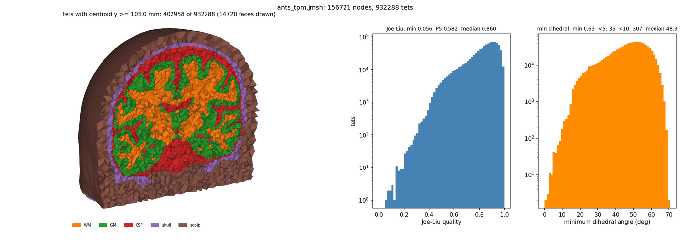
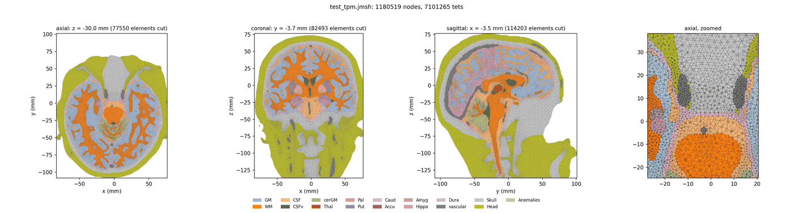
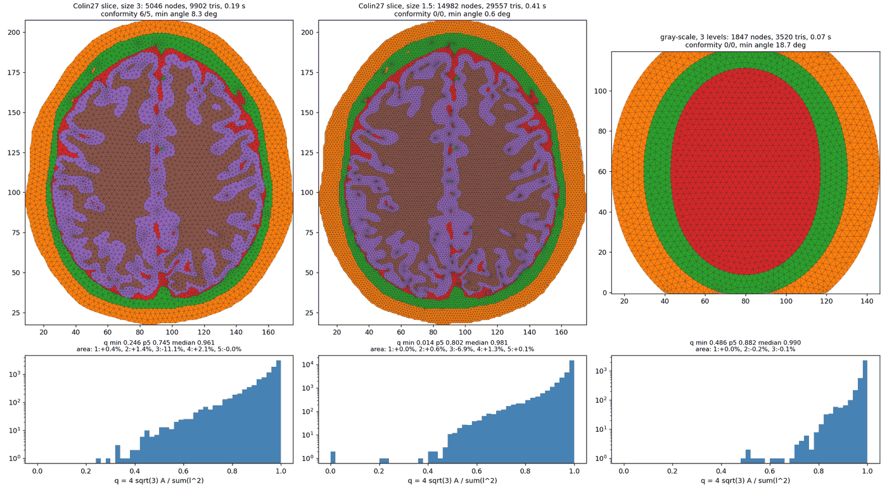

# v2mesh - Fast, Conforming Tetrahedral Meshes from Images

[](https://github.com/fangq/trussnet/actions/workflows/ci.yml)
[](https://github.com/fangq/trussnet/actions/workflows/wheels.yml)
[](#license)

- **Copyright**: (C) Qianqian Fang (2026) \<q.fang at neu.edu>
- **License**: GNU General Public License, version 3 or later
- **Version**: 0.5.0
- **GitHub**: <https://github.com/fangq/trussnet>

**Give it a segmented image, get back a tetrahedral mesh.** `v2mesh` turns a
multi-label volume, a gray-scale image with iso-levels, or a tissue-probability
map into a conforming tetrahedral mesh: every tissue gets its own elements, the
surfaces between tissues are shared exactly, and the outside is never meshed. A
2-D image gives a triangle mesh the same way.

It is fast because the heavy part runs on the GPU: the nodes are placed by a
spring (truss) relaxation — the moving-particle idea of DistMesh — as OpenCL
kernels, and the exact Delaunay tetrahedrization is built on the GPU too. A
brain head model with a million elements takes seconds, not minutes. No GPU? It
runs, unchanged, on the CPU.

> **Who it's for:** anyone who builds finite-element or Monte Carlo models from
> medical or microscopy images — brain and head models for optical, EEG/MEG or
> electrical simulations, small-animal atlases, phantoms. If you have used
> **iso2mesh**, **brain2mesh** or CGAL's mesher, the inputs and outputs will look
> familiar; the difference is that `v2mesh` takes the segmentation (or the
> probabilities) directly and never needs a surface mesh first.

<p align="center">
  
</p>

---

## Contents

- [Highlights](#highlights)
- [What it can mesh](#what-it-can-mesh)
- [Installation](#installation)
- [Getting started](#getting-started)
  - [Command line](#command-line)
  - [MATLAB and GNU Octave](#matlab-and-gnu-octave)
  - [Python](#python-1)
  - [v2m (GUI)](#v2m-gui)
- [Controlling the mesh](#controlling-the-mesh)
- [Output](#output)
- [Processing modes](#processing-modes)
- [Shape input](#shape-input)
- [Command-line reference](#command-line-reference)
- [Performance](#performance)
- [How it works](#how-it-works)
- [Troubleshooting](#troubleshooting)
- [For developers](#for-developers)
- [License](#license)
- [Credits and links](#credits-and-links)

---

## Highlights

- **Straight from the image.** A label volume, a gray-scale image and its
  thresholds, or a 4-D tissue-probability map — no surface extraction, no
  surface repair, no boolean operations first.
- **Conforming by construction.** Neighbouring tissues share their interface
  triangles; nodes sit on the interfaces and on the curves where three tissues
  meet. The mesh is checked and repaired until it conforms.
- **Any number of tissues.** Two, six, seventeen — the 18-class siamize brain
  segmentation meshes with its deep grey nuclei as separate regions.
- **Fast on a GPU, correct without one.** The relaxation and the Delaunay
  tetrahedrization run as OpenCL kernels; the result is exactly the same
  Delaunay mesh the CPU code builds, and the CPU path is always there.
- **Good elements.** Graded sizes, a radius-edge bound (`-q`, as in TetGen),
  sliver removal and smoothing: a median Joe-Liu quality near 0.88, and fewer
  than one element in ten thousand below 10° on brain models.
- **Sizes where you want them.** A default size, per-tissue sizes, automatic
  refinement at curved and thin structures, or your own sizing field.
- **Deterministic.** The same input gives the same mesh, byte for byte, on the
  GPU or the CPU.
- **Three front ends, one engine.** A command-line program, a MATLAB/Octave
  function and a Python package, all calling the same code.

---

## What it can mesh

| Input | What v2mesh does | Example |
|---|---|---|
| **Label volume** (integers; 0 = outside) | a region per label, with shared interfaces | a segmented head, an atlas |
| **Gray-scale volume** and thresholds | the iso-surfaces between the levels become the interfaces, at sub-voxel accuracy | a sensitivity map, a CT image |
| **Tissue-probability map** (4-D: one channel per class) | labels from the most probable class; "background" or "air" channels, or `1 - sum`, are the outside; enclosed air pockets are filled | SPM tissue maps, siamize or other network outputs |
| **2-D image** (labels or gray-scale) | a triangle mesh with the same guarantees | a slice, a histology image |
| **Shape constructs** (JSON: MCX `Shapes`, JMesh `Shape*` / `CSG*`) | exact signed distance functions, evaluated by the mesher itself; sharp edges and corners pinned | a phantom, a lens, a device model |
| **CAD models** (STEP `.step` / `.stp`) and **TetGen PLCs** (`.poly` / `.smesh`) | a watertight surface (each STEP solid a label), meshed by `--mode cdt` with its faces kept, or remeshed | a machined part, an assembly of solids |

Files: NIfTI (`.nii`, `.nii.gz`) and JNIfTI (`.jnii` text, `.bnii` binary), 3-D
or 4-D. The MATLAB and Python front ends also take arrays directly. Every image
is turned to RAS (its sform, else its qform). A JNIfTI header whose `Affine` is
missing or all zeros falls back to its qform, then its `Orientation` letters
with `VoxelSize`, then `VoxelSize` alone. jsonlab's `savejnifti` writes such a
header for an Analyze 7.5 `.hdr`/`.img`, which records no orientation.

<p align="center">
  
</p>

---

## Installation

### Python

```sh
pip install v2mesh
```

Wheels are built for Linux (x86_64), macOS (Apple Silicon and Intel) and
Windows (x64), Python 3.9–3.13. They use a GPU through the OpenCL driver you
already have (NVIDIA, AMD, Intel or Apple), loaded when first needed, and fall
back to the CPU if there is none: nothing OpenCL has to be installed. Until the first release is on PyPI, install from a checkout:
`pip install ./pyv2mesh`.

### MATLAB and GNU Octave

Build the MEX file from a checkout (see [Build from source](#build-from-source)),
then

```matlab
addpath('/path/to/v2mesh/matlab');
```

Every CI run also produces prebuilt Linux MEX files (the repository's *Actions*
tab, artifacts `v2mesh-matlab-mex-linux` and `v2mesh-octave-mex-linux`).

### The command-line program

Every CI run produces standalone binaries for Linux, macOS and Windows
(artifacts `v2mesh-linux-x86_64`, `v2mesh-macos-14`, `v2mesh-windows-x64`).
They need no installation; an OpenCL driver is optional.

### Build from source

You need a C++11 compiler (GCC, Clang or MinGW-w64) and CMake 3.12 or newer.
Optional: the OpenCL headers for the GPU path (`opencl-headers` on Debian,
Ubuntu and Fedora; the CUDA toolkit's also work) and OpenMP (`libomp` on
macOS). Only the headers are needed: the program does not link OpenCL, but
loads the system's OpenCL library at run time (`libOpenCL.so.1`,
`OpenCL.dll`, the macOS framework; `V2M_OPENCL_LIB` names another), so one
binary runs with or without a GPU driver. Without the headers, CMake warns and
builds the CPU-only program.

```sh
git clone https://github.com/fangq/trussnet.git
cd trussnet
make                 # the command-line program: build/v2mesh
make check           # ... and run its tests
make bindings        # also the Python module and the MATLAB / Octave MEX
make test            # ... and all of their tests
```

| CMake option | Default | What it does |
|---|---|---|
| `V2M_USE_OPENCL` | ON | the GPU path; OFF, or no OpenCL headers found: CPU only |
| `V2M_BUILD_PYTHON` | OFF | the Python module |
| `V2M_BUILD_MATLAB_MEX` | OFF | the MATLAB MEX (set `Matlab_ROOT_DIR` if MATLAB is not on the `PATH`) |
| `V2M_BUILD_OCTAVE_MEX` | OFF | the Octave MEX (needs `mkoctfile`) |
| `V2M_STATIC_LINK` | OFF | a self-contained binary (static C++ runtime; fully static with MinGW) |
| `V2M_BUILD_TESTS` | OFF | register the command-line tests with `ctest` |

---

## Getting started

### Command line

```sh
# a label volume, 2 mm elements, on the GPU
v2mesh -i head_labels.nii.gz --size 2 --gpu -o head.jmsh

# finer elements in labels 3 and 4
v2mesh -i head_labels.nii.gz --size 3 --lsize 3:1.5,4:2 --gpu -o head.bmsh

# a gray-scale image, meshed at three iso-levels
v2mesh -i intensity.nii.gz --thresholds 0.2,0.5,0.8 --size 2 -o levels.jmsh

# a tissue-probability map (the 18 siamize classes merged to SPM's six)
v2mesh -i tpm.bnii --tpm-spm6 --gpu -o head.jmsh

# no data at hand? a built-in phantom
v2mesh --shape shells --dim 96 -o shells.jmsh
```

Every run ends with a summary: the mesh size, the conformity checks, the volume
error of each tissue and the element quality. `-v` also prints the progress.

### MATLAB and GNU Octave

```matlab
[node, elem, face, info] = v2mesh(vol, 'size', 3, 'gpu', 1);

% options as a struct; per-tissue sizes; gray-scale levels
opt = struct('size', 3, 'lsize', [0 1.5 2], 'reratio', 2);
[node, elem, face] = v2mesh(vol, opt);
[node, elem, face] = v2mesh(img, 'thresholds', [0.2 0.5 0.8], 'size', 2);

% a file (NIfTI / JNIfTI, including 4-D probability maps), in its world coordinates
[node, elem, face] = v2mesh('tpm.bnii', 'size', 3);

% a 2-D image gives triangles
[node, elem, face] = v2mesh(slice2d, 'size', 2);

plotmesh(node, elem);          % with iso2mesh
```

`help v2mesh` lists every option.

### Python

```python
import v2mesh

out = v2mesh.tetmesh(vol, size=3, gpu=True)                 # vol[x, y, z]
out = v2mesh.tetmesh(vol, size=3, lsize={2: 1.5, 3: 2})     # per-tissue sizes
out = v2mesh.tetmesh(img, thresholds=[0.2, 0.5, 0.8])       # gray-scale levels
out = v2mesh.tetmesh(tpm4d, tpm_exterior=[0])               # tpm4d[x, y, z, class]
out = v2mesh.tetmesh_file("head.nii.gz", size=3)            # a file, world coordinates
tri = v2mesh.trimesh(slice2d, size=2)                       # a 2-D image

node, elem, face, info = out["node"], out["elem"], out["face"], out["info"]
```

<p align="center">
  
</p>

### v2m (GUI)

[`v2m/`](v2m/README.md) is a graphical front end (Lazarus/OpenGL). It
opens a `.nii`/`.nii.gz`/`.jnii`/`.bnii` image, sets every v2mesh option,
runs v2mesh, and shows the image and the mesh together, in millimetres. You
can crop both to an x/y/z box (the mesh as a cut-out of its elements), and make
them translucent. It also opens surfaces (`.jmsh`/`.bmsh` `MeshTri`, `.off`,
`.stl`) and runs the mesh modes on the mesh shown (remesh, repair, cdt,
optimize; see [Processing modes](#processing-modes)). Build it with
`make -C v2m`.

---

## Controlling the mesh

The options are the same in all three front ends: `--size` on the command line,
`'size'` in MATLAB, `size=` in Python. Names ignore case and underscores.

| To... | Use |
|---|---|
| set the element size | `size` (mm; default 3 voxels), with `hmin` / `hmax` as the limits |
| give a tissue its own size | `lsize`: `2:1.5` on the command line; a vector or `{label: size}` in MATLAB / Python |
| refine at interfaces only, coarse inside | `isize`: `2` (every interface), `0:2` (every interface of label 0, the outer surface), `3:4:1.5` (the 3\|4 interface), mixed as `2,0:3,3:4:1.5`; in MATLAB a scalar, `[label size]` or `[a b size]` rows, in Python a number or `{label: h, (a, b): h}`. `size` / `lsize` set the interiors, `grad` how fast they coarsen |
| supply your own sizing | `sizing` (MATLAB / Python): an array shaped like the image (0 = automatic at that voxel), or one size per tissue, level or channel |
| refine more at curved surfaces | `K`: elements per radian of curvature (default 3) |
| resolve thin layers | `thick B`: elements no larger than the local thickness / B |
| grade the sizes more or less gently | `grad`: the size gradient limit (default 0.3) |
| thin out crowded nodes (thin layers next to fine interfaces) | `thin`: e.g. `0.7` removes the seeds closer than 0.7 h to a kept one on the same interface / in the same tissue, before the relaxation (default off) |
| bound the element quality | `-q` / `reratio`: the radius-edge ratio (default 2; 0 = off) |
| smoother region surfaces, volumes kept | `--surf-smooth N` / `surf_smooth`: N passes of iso2mesh `smoothsurf`'s volume-preserving smoothing over the surfaces after the tessellation: `laplacianhc` (default), `lowpass` or `laplacian` (`--surf-smooth-method`), with `--surf-smooth-alpha` / `-beta` (0.5, 0.5). Each interface moves with its own nodes, junction curves along themselves; corners and the image's cut faces stay; no tet is inverted. Unlike a larger `--sigma` it does not move thin layers into their neighbours; a larger beta (0.9) keeps small, curved regions' volumes closer still |
| bound the element volume (`cdt`, `optimize`) | `--maxvol` / `maxvol`: the largest tet volume, mm³ (TetGen `-a`). Larger tets get a point inside them, or their longest edge bisected (a surface edge's midpoint stays on the surface), so creases and corners are kept and every region's volume is unchanged |
| mesh a gray-scale image's iso-surfaces | `thresholds`, and `gray_sigma` to smooth the intensity first |
| move a probability map's interfaces | `tpm_thresh`: a per-label threshold (default 0.5 = the most probable tissue), e.g. `2:0.4` grows label 2: label = argmax(p − t + 0.5), and with `tpm_fields` the probability fields shift alike (sub-voxel) |
| choose a probability map's outside | `tpm_exterior`, `tpm_map` (merge channels), `tpm_spm6`, `tpm_holes` |
| use the GPU | `--gpu` / `gpu=True` (`gpuid` picks a device); falls back to the CPU |

---

## Output

| Front end | Nodes | Elements | Boundary and interfaces |
|---|---|---|---|
| Command line | `.jmsh` (JSON text) or `.bmsh` (binary JSON), [JMesh](https://github.com/NeuroJSON/jmesh) format: `MeshNode` | `MeshElem`: M × 5 `[v1 v2 v3 v4 label]` | `MeshTri`: P × 5 `[v1 v2 v3 inner outer]` (`--faces`, `--mode surface` / `repair`) |
| MATLAB / Octave | `node`: N × 3 | `elem`: M × 5 `[v1 v2 v3 v4 label]`, 1-based | `face`: P × 5 `[v1 v2 v3 inner outer]` |
| Python | `node`: (N, 3) | `elem`: (M, 5), 1-based | `face`: (P, 5) |

- `face` holds the outer surface (`outer = 0`) and each interface between two
  tissues once, with its normal pointing from `inner` to `outer`.
- `info` reports the counts, the conformity checks (all zero: conforming), the
  element quality and the timings.
- Coordinates are in the file's world space for file input. For arrays, pass
  `affine` (a 4 × 4 voxel-to-world matrix) or `voxelsize`; without them MATLAB
  uses its 1-based index space and Python the 0-based one.
- 2-D meshes: `node` N × 2, `elem` M × 4 `[v1 v2 v3 label]`, and `face` P × 4
  `[v1 v2 inner outer]` (edges).

---

## Processing modes

`--mode` runs one stage of the mesher on its own, or starts from a mesh or a
surface instead of an image:

| `--mode` | Input (`-i`) | Output (`-o`) |
|---|---|---|
| `mesh` (default) | an image, or `--shape` | labelled tets; with `--faces` also the region surfaces |
| `surface` | an image | only the region and exterior surfaces (closed, conforming); only the surface nodes are tessellated, 1.4-2x faster than a full run (`--exact-tess`: every node) |
| `points` | an image | the relaxed nodes, before tessellation, with their labels and types |
| `tessellate` | points (`.xyz`, `.off`, `.jmsh`) | their Delaunay tets; with `--image` (or `--shape`) and `points` output, the full tessellation, identical to a `mesh` run |
| `optimize` | a labelled tet mesh | the same regions with better tets: `-q` refinement (circumcentres of tets above the radius-edge bound, inside their region, never encroaching an interface), and `--maxvol` refinement (the tets above a volume: a point inside, else their longest edge bisected), then flips, collapses, Steiner points, smoothing; interfaces and boundary kept |
| `cdt` | closed, non-intersecting surfaces, a TetGen PLC, a STEP model, or shape constructs (their exact surface, below; see [Surface regions](#surface-regions)) | labelled tets with the surfaces kept exactly (constrained Delaunay, interior points on a lattice, `--cdt-fill`), then `-q` refinement and the optimiser as `optimize` |
| `remesh` | closed surfaces, which may self-intersect, overlap or be oriented either way | labelled tets of the regions they enclose: rasterized to soft fields (`--raster-voxel`), then the whole mesher |
| `repair` | as `remesh` | the region surfaces, clean: closed, no self-intersections |
| `check` | a tet mesh or a surface | a report (quality, inverted tets, open and junction edges, self-intersections); exit code 3 on problems |

Meshes are read from `.jmsh`/`.bmsh` (`MeshNode`, `MeshElem`, `MeshTri` or
`MeshSurf`, with or without label columns), `.off`, `.stl` (ASCII or binary),
`.xyz` (points, with an optional label column), TetGen piecewise linear
complexes (`.poly`, `.smesh`, the points in a `.node` file beside them when the
file lists none), and CAD models in STEP (`.step`, `.stp`). How the regions of a surface are found is under
[Surface regions](#surface-regions).

**CAD models (STEP).** `.step` / `.stp` files (ISO 10303-21: AP203, AP214,
AP242 B-reps) are read by v2mesh's own parser, with no CAD kernel. Each solid
(`MANIFOLD_SOLID_BREP`, `BREP_WITH_VOIDS`: a void is a hole in its solid; else
the shells of a `SHELL_BASED_SURFACE_MODEL`) becomes one label, 1, 2, .. in
file order, and the result is a closed triangle surface in mm (the file's
unit, SI or inch-based, converted). Supported geometry: planes, cylinders,
cones, spheres, tori (spindle ones too), rational and polynomial B-spline
surfaces, surfaces of revolution and of linear extrusion; lines, circles,
ellipses, B-spline curves, polylines, surface / seam / trimmed curves. Every
edge is sampled once and shared by its two faces, so the surface is
watertight; each face is triangulated in its own parameter plane. Periodic
loops are unwrapped, loops that go round the surface are cut along a seam,
caps are closed at their pole or apex, and a face bounded only by holes on a
closed surface is the rest of that surface. `--step-tol` sets the chord
tolerance (default 0.05 % of the model's size) and `--step-angle` the largest
turn (15 degrees). `--size` caps the edge length, planes included, so `cdt`
gets surface triangles it can fill well. Not read: assemblies' placed
instances (each solid is taken where it is defined), offset surfaces and
curves, and faceted or wireframe models. A face that cannot be tessellated is
named in the log and left out.

```bash
v2mesh --mode cdt -i part.step --size 2 -o part.jmsh          # a CAD solid, faces kept
v2mesh --mode remesh -i assembly.step --size 1 -o parts.jmsh  # its solids, remeshed
```

**Exact shape surfaces.** Shape constructs (a `.json` of MCX `Shapes` or
JMesh `Shape*` / `CSG*`) given to `--mode cdt` (or `convert`) become their
exact boundary surface, so the tets keep every crease, corner and knife edge
exactly -- a box less a larger sphere has circular hole rims, however thin
the wedge. Each primitive's surfaces are patches of their parameter planes (a
box's 6 faces, a sphere's two halves, a cylinder's or cone's two half-sides
and half-disk caps, a torus's quarters), each edge sampled once and shared.
Where two primitives' surfaces cross, the curve is traced once, its points
on both surfaces, split where a third surface crosses it (a triple point, on
all three). Faces lying on each other (a layer or `Subgrid` on the domain's
walls, a cylinder's cap on a face) are triangulated once, together. Each
patch is triangulated in its plane with those curves as constraints, and a
piece is kept where the composed labels (the CSG, clipping, `--overlap`)
differ across it. `--step-tol`, `--step-angle` and `--size` set the chord
tolerance, the turn and the edge length, as for STEP. Supported: boxes
(`Grid`, `Box`, `Subgrid`, `ShapeBox3`), spheres, cylinders, cones and
frusta, tori; planes, slabs, layers, ellipsoids, lenses, and two curved
surfaces lying on each other are not yet (an error says so; `--mode mesh`
meshes them).

```bash
v2mesh --mode cdt -i design.json --size 3 -o design.jmsh     # shapes, edges exact
```

**TetGen PLCs.** Each facet (polygons in one plane, with holes) is split into
triangles by a constrained triangulation of its polygon edges, less what lies
outside them and round its hole points; a non-convex polygon is fine. `cdt`
keeps the facets exactly, so their triangles are its surface: with `--size H`
every polygon edge is split to at most H (the same points for every facet
sharing it), and a facet in an axis plane is filled with points H apart, so
the surface triangles are well shaped rather than the polygons' long fans. (A
slanted facet gets its edges' points only: a point computed inside it would
miss its plane by a rounding, which the exact CDT would fill with slivers.) A volume hole (part 3) drops the compartment holding
it; a region (part 4) gives its compartment its region number as the label
(the others keep automatic labels, numbered above the highest region number).
Not kept: segments and points inside a facet or on their own (a facet without
area, such as iso2mesh's `3 a a b` segments, is counted in the log and
dropped; loose points still go into the tessellation), facet boundary
markers, and the regions' volume constraints.

```bash
v2mesh -i head.nii.gz --mode surface -o head_surf.jmsh      # surfaces only
v2mesh --mode cdt -i head_surf.jmsh -o head_cdt.jmsh         # tets keeping those surfaces
v2mesh --mode cdt -i part.poly -o part.jmsh                  # a TetGen PLC, facets kept
v2mesh --mode repair -i broken.stl --size 2 -o fixed.jmsh    # a clean surface from a broken one
v2mesh --mode optimize -i mesh.jmsh -o better.jmsh           # the optimiser alone
v2mesh --mode check -i fixed.jmsh                            # is it closed? does it cross itself?
```

### Surface regions

`cdt`, `remesh` and `repair` need to know which region each part of space
belongs to. A surface file can say this in three ways:

| Faces | Meaning |
|---|---|
| `[v1 v2 v3 inner outer]` (M×5, as v2mesh writes) | the labels on the face's two sides; the normal points from inner to outer |
| `[v1 v2 v3 label]` (M×4) | the face bounds region `label`; the other side is whatever surrounds it. A face given twice, labelled `a` and `b`, lies between `a` and `b`, so per-region surfaces that touch work |
| `[v1 v2 v3]` (M×3, `.off`, `.stl`) | no labels: each enclosed space is a region of its own |

**Surfaces that don't cross** (check with `--mode check`) are labelled exactly.
Nodes closer than 1e-7 of the extent are merged and repeated faces combined.
The constrained Delaunay tetrahedralisation of the surface splits space into
cells, and the face labels decide each cell, outward from the exterior. The
result is converted to inner/outer labels. This handles, for example:
- nested shells;
- regions that share faces, stored once or once per region;
- a shell labelled like the region around it, which makes a hole (a cavity, 0);
- unlabelled surfaces where three or more sheets meet at an edge.

Unlabelled cells are numbered with `--auto-labels cell` (the default:
outermost first, then largest) or `--auto-labels depth` (the number of
surfaces around the cell). If every face points outward, a cell no surface
winds around, such as a pocket or a cavity, is exterior.

**Surfaces that cross** can only go to `remesh`/`repair`; `cdt` refuses them.
Each label's faces form closed shells, or each connected piece does when
there are no labels. Inside a shell means wound around at least once, so
folds and self-overlaps count once. A shell labelled like the region around it
is a hole. `--overlap` decides who owns a volume that two regions both claim:

| `--overlap` | The overlap goes to |
|---|---|
| `nest` (default) | the smaller region: an inclusion keeps all of itself, even where it pokes out |
| `split` | both, divided halfway between the two surfaces |
| `max`, `min` | the higher / lower label |
| `order:3,1,2` | the first listed (unlisted labels after, smallest first) |
| `union` | overlapping regions become one (the lowest label) |
| `cells` | a region of its own: A only, B only, and A∩B are three labels |

When crossing surfaces are also non-manifold, or labelled with each shared
face stored once, there is no inside test to use. The cells are then found on
the raster instead (the surfaces act as walls for a flood fill), labelled the
same way, and smoothed by a voxel. Accuracy is about a voxel, and `--overlap`
doesn't apply there. Each line of the log (`[cdt] surfaces: ...`,
`[remesh] surfaces: ...`) says which of these paths was taken.

The same stages from Python and MATLAB / Octave (arrays 1-based; `face` P × 5
`[v1 v2 v3 inner outer]`, or P × 3 / P × 4 shells):

| `--mode` | Python (`import v2mesh`) | MATLAB / Octave |
|---|---|---|
| `surface` | `v2mesh.surface(vol, size=3)` | `[no, ~, fc] = v2mesh('surface', vol, opt)` |
| `points` | `v2mesh.points(vol)` → `node`, `label`, `type`, `partner` | `[no, ~, ~, info] = v2mesh('points', vol, opt)` |
| `tessellate` | `v2mesh.tessellate(node, label=None)` | `[no, el] = v2mesh('tessellate', node, label)` |
| `optimize` | `v2mesh.optimize(node, elem)` | `[no, el] = v2mesh('optimize', node, elem, opt)` |
| `cdt` | `v2mesh.cdt(node, face, fill=None)` | `[no, el, fc] = v2mesh('cdt', node, face, opt)` |
| `remesh` | `v2mesh.remesh(node, face, raster_voxel=None, size=2)` | `[no, el, fc] = v2mesh('remesh', node, face, opt)` |
| `repair` | `v2mesh.repair(node, face, size=2)` | `[no, ~, fc] = v2mesh('repair', node, face, opt)` |
| `check` | `v2mesh.check(node, elem=None, face=None)` → a dict with `ok` | `info = v2mesh('check', node, elem, face)` |

---

## Shape input

v2mesh meshes geometry described as shapes, not only images. A shape file
(`-i shapes.json` or `--shape shapes.json`, `v2mesh.shapes(...)` in Python,
`v2mesh(struct_or_json, opt)` in MATLAB) is one sequence of objects:

- **Object 1 is the outermost shape.** Everything outside it is exterior (label 0).
- **Each later object overwrites the ones before it**, and is cut to object 1
  (`"Clip": false` or `--shape-clip 0`: not cut). This is MCX's painting order.
- **An object's label is its `Tag`** (default 1). A `Tag` of 0 makes the space
  it covers exterior, like a cavity.
- **Overlaps: `--overlap RULE`** changes who owns a volume two objects claim
  (object 1, the container when everything is cut to it, always yields to
  the objects inside it):

  | Rule | An overlap goes to |
  |---|---|
  | `overwrite` (default) | the later object (MCX) |
  | `nest` | the smaller object |
  | `max` / `min` | the higher / lower label |
  | `order:L1,L2,..` | the first listed label |
  | `split` | both: they meet halfway, where s_a = s_b |
  | `union` | one region: overlapping objects take the first one's label |
  | `cells` | its own new label (listed in the log): every object's whole surface stays an interface, and each piece between them is a region |

  Where two objects' surfaces cross (with any rule, and where an object runs
  through the domain's walls), the regions have a crease that no shape's edge
  list holds: four regions meet along it with `cells`, three otherwise. These
  curves are traced and pinned (twice as densely as an edge), through their
  exact corners. With `cells`, two objects overlapping, or a chain of them,
  mesh conforming. Where three
  surfaces cross at one point (eight regions), or a crossing curve meets a
  box edge, a node would need more labels than the mesher keeps (four), and a
  few faces there may not conform yet.

```json
{"Shapes": [
  {"Grid":     {"Tag": 0, "Size": [100, 100, 100]}},
  {"Sphere":   {"O": [50, 50, 50], "R": 35, "Tag": 2}},
  {"Sphere":   {"O": [50, 50, 50], "R": 20, "Tag": 3}},
  {"Cylinder": {"C0": [0, 50, 50], "C1": [100, 50, 50], "R": 10, "Tag": 4}},
  {"Box":      {"O": [35, 35, 72], "Size": [30, 30, 20], "Tag": 5}}
]}
```

| Vocabulary | Constructs |
|---|---|
| MCX / rtmmc | `Grid` {Size}, `Box` {O, Size}, `Subgrid` {O (1-based), Size}, `Sphere` {O, R}, `Cylinder` {C0, C1, R}, `X/Y/ZSlabs` {Bound: [[lo, hi], ..]}, `X/Y/ZLayers` [[lo, hi, tag], ..] (1-based), `Lens` {O, Dir, R, Front/Back {D, R}} |
| JMesh | `ShapeBox3` {O, P}, `ShapeSphere` {O, R}, `ShapeCylinder` {O, P, R}, `ShapeCone` {O, P, R}, `ShapeConeFrustum` {O, P, R: [r1, r2]}, `ShapeEllipsoid` {O, R: [rx, ry, rz], Angle: [azimuth, zenith]}, `ShapeTorus` {O, R, Rtube, N}, `ShapeSphereShell` {O, R: [r1, r2]}, `ShapeSphereSegment` {O, R, N, Height: [h1, h2]}, `ShapePlane3` {O, N} (the half-space behind N) |
| CSG | `CSGObject` [root, {Tag}], `CSGUnion` / `CSGIntersect` / `CSGSubtract` [a, b, ..] (left to right; a single operand is itself, as while a design is built). Operands are inline constructs or names: `"ShapeSphere(hole)": {..}` defines `hole`, and a named construct that a CSG uses is a building block, not an object of its own. |

A JMesh document (top-level `Shape*` / `CSG*` keys, in order) works the same
way as a `Shapes` array.

**How it is meshed:**
- **Exact fields.** Each shape is an exact signed distance function
  (union = max, intersection = min, subtraction = min(a, −b)). The mesher
  evaluates the labels' fields directly, on the CPU and the GPU, instead of a
  sampled volume, so surface nodes lie on the true surfaces. The `[sdf]` line
  reports how far they are from them (about 1e-5 of the element size).
  CSG creases are blended over 0.15 voxel of the sizing raster, but not where
  two surfaces lie on each other (a box's face on the domain's wall), which
  a blend would move.
- **Sharp features.** Box corners and edges, cylinder and cone rims, cone
  tips, and sphere-segment and lens rims are seeded as pinned nodes where they
  lie on the final surfaces, with the curves where objects' surfaces cross.
  Between two neighbouring pinned nodes no other node is left (the segment's
  diametral ball is emptied), so the tessellation keeps them joined and an
  edge comes out straight. A box, inside the domain, through its walls, on
  them, or cut by another box, comes out with its exact volume and flat
  faces.
- **Knife edges.** Where the regions meet at an acute angle along a feature
  curve (a box less a larger sphere: its holes' rims, 31 degrees), the
  elements there are finer in proportion to the angle (down to `--hmin`), and
  the curve's pins are found by sampling the labels round it finely, so the
  thin wedge is kept. The gap closing of `--shape-gap` acts where two objects
  touch, never inside one object's own CSG, whose booleans are exact. For the
  rims exact, mesh the design with `--mode cdt` (see Exact shape
  surfaces under [Processing modes](#processing-modes)).
- **Sizing.** Element sizes follow the shapes' own curvature (`-K`), so an
  edge does not force small elements. A raster of `--raster-voxel` spacing
  (default size / 3) carries the sizing and the candidate labels only.

A layer that thins to zero thickness, such as two shapes exactly tangent to
each other, cannot be resolved by any element size. It is left with a few
non-conforming tets there; moving one shape apart by a fraction of the
element size removes them.

## Command-line reference

```
v2mesh (-i volume | --shape NAME [--dim N]) [options]
```

| Option | Meaning |
|---|---|
| `-i FILE` | input: `.nii`, `.nii.gz`, `.jnii`, `.bnii` (3-D, or 4-D probabilities) |
| `-o FILE` | output: `.jmsh` (text) or `.bmsh` (binary) |
| `--mode M`, `--faces`, `--image FILE`, `--opt-rounds N`, `--cdt-fill H`, `--raster-voxel V` | the stage(s) to run and their options (see [Processing modes](#processing-modes)) |
| `--manifold`, `--nest L1,L2,..` | no pinched edges in the region surfaces (see [Troubleshooting](#troubleshooting)) |
| `--shape FILE.json`, `--shape-clip 0\|1` | shape constructs (see [Shape input](#shape-input)) |
| `--overlap RULE`, `--auto-labels cell\|depth` | how the regions of surfaces are found (see [Surface regions](#surface-regions)); `--overlap` also decides who owns overlapping shape objects (default `overwrite`; see [Shape input](#shape-input)) |
| `--size MM`, `--hmin MM`, `--hmax MM` | element size and its limits |
| `--lsize L:H,...` | per-label element size |
| `--thin B` | seed thinning before the relaxation (e.g. 0.7; default off) |
| `--isize H\|L:H\|A:B:H,...` | element size at interfaces only: every interface, every interface of label L, or the A\|B interface |
| `--K K`, `--grad G` | curvature refinement; size gradient limit |
| `--thick B`, `--thin-floor V` | thin-layer sizing |
| `--sigma S`, `--sigma-thin S`, `--preserve M` | interface smoothing |
| `--thresholds T1,T2,...`, `--gray-sigma S` | gray-scale input |
| `--tpm-exterior C,...`, `--tpm-map L0,L1,...`, `--tpm-spm6`, `--tpm-sigma S`, `--tpm-thresh T\|L:T,...`, `--tpm-holes`, `--tpm-fields` | probability-map input |
| `-q Q` | radius-edge bound (default 2; 0 = off) |
| `--maxvol V` | `cdt` / `optimize`: largest tet volume (mm³; TetGen `-a`; 0 = off) |
| `--opt 0\|1`, `--smooth N`, `--repair N` | sliver repair; smoothing passes; conformity repair rounds |
| `--iters N`, `--fscale F`, `--fsurf F`, `--dt T`, `--snap S`, `--nseed N`, `--jseed C`, `--no-corners`, `--trap smooth\|voxel` | relaxation |
| `--relax fire\|jacobi`, `--fire-dtmax X`, `--dptol T` | relaxation step: FIRE (default; inertial, adaptive time step: about 1.5-2x fewer iterations than Jacobi for a better mesh) or Jacobi (always with `--trap voxel`); stopping tolerance (0 = run all `--iters`) |
| `--gpu [N]` | run on OpenCL device N (the first GPU by default) |
| `--shape NAME`, `--dim N` | a built-in phantom (`--help` lists them; `disk2d` and `gray2d` are 2-D) |
| `-v`, `--version`, `--help` | progress; version; help |

A single-slice volume is meshed in 2-D.

---

## Performance

On an NVIDIA TITAN V, with the relaxation and the Delaunay on the GPU and the
rest on the CPU:

| Model | Tissues | Elements | Time |
|---|---|---|---|
| ANTS 40–44-year atlas (brain2mesh's sample data) | 5 | 0.95 M | 6.6 s (brain2mesh: 28 s) |
| Colin27 adult head, 4 mm elements | 6 | 5.4 M | 31 s |
| siamize probability map, SPM's 6 classes | 5 | 6.8 M | 40 s |
| siamize probability map, 18 classes | 17 | 7.3 M | 51 s |
| A 2-D brain slice (183 × 219 pixels) | 5 | 30 k triangles | 0.4 s |

The GPU Delaunay is about 3.4× faster than the exact CPU code on Colin27, and
builds the identical mesh.

---

## How it works

1. **Fields.** Each tissue becomes a smooth field (a smoothed indicator, a
   gray-scale membership, or its probability). The interface between two
   tissues is where their fields are equal, at sub-voxel positions.
2. **Sizes.** An element size per voxel, from the defaults, the per-tissue
   sizes, the interface curvature and optionally the layer thickness, graded so
   that it changes smoothly.
3. **Seeds.** Hexagonal lattices at a few graded spacings fill each tissue, with
   fixed nodes where three or more tissues meet.
4. **Relaxation.** The nodes push each other apart like a truss of springs
   (DistMesh). A node that reaches an interface is trapped on it and glides
   along it. This runs as OpenCL kernels.
5. **Tessellation.** An exact Delaunay tetrahedrization of the nodes (on the GPU,
   with exact predicates); elements labelled by their nodes' tissues; anything
   outside removed; local repairs until every interface conforms.
6. **Quality.** Radius-edge refinement, flips, collapses and guarded smoothing
   remove the remaining slivers.

---

## Troubleshooting

**`OpenCL unavailable ... running on the CPU`.** No OpenCL library (`no OpenCL
loader found`), no usable OpenCL device, or it was busy or out of memory. The mesh is the same, only slower.
Install your GPU vendor's driver (or `pocl` for a CPU OpenCL device). On a
shared GPU, other programs holding its memory can cause this too.

**Region surfaces with pinched edges (edges on 4 or more faces).** Where two
voxels of a label touch only along an edge or at a corner (a checkerboard,
often where CSF between two sulcal banks vanishes), the segmentation is
ambiguous: the two parts may or may not be connected. The mesh follows the
voxels, so two parts of the region meet along one edge. The tets are valid,
but the region surfaces are not manifold there (on colin27, `--size 4`: about
2800 such edges, 92% at diagonal voxel contacts). `--manifold` opens each one
by giving the tets of one wedge round the edge the other label: the smaller
wedge, or at the exterior, the region's wedge is removed. It moves no nodes,
and changes per-label volumes by less than 0.05% on colin27 (about 2 s).
`--nest 3,4,5` (labels outermost first, e.g. CSF, GM, WM; implies
`--manifold`) encodes the expected nesting instead: at a pinch the inner label
is joined, since the outer layer is locally of zero thickness. A piece of an
outer label cut off by this and enclosed by inner labels (a CSF pocket inside
GM) merges into them. Pieces that were already separate, such as the
ventricles, are left alone.

**A thin layer (CSF, skin) is a few percent smaller than its voxel count.** A
layer one or two voxels thick is hard to resolve with larger elements. Add
`--thick 2` (elements no larger than half the local thickness), or give that
tissue a smaller `lsize`.

**`... bricks see more labels ... than a brick holds`.** More than 16 tissues
meet in one small neighbourhood, and the extra interfaces are lost there. Merge
classes (`--tpm-map`, `--tpm-spm6`), or raise `V2M_BL` in
`src/opencl/v2m_grid_body.cl`.

**A few conformity residuals remain** — a handful of bad faces in a
million-element brain. They sit where layers are thinner than a voxel; the
per-tissue volume errors in the summary show whether they matter. More
`--repair` rounds or smaller elements there reduce them.

**The MATLAB MEX crashes on load** (an older build). MATLAB's own OpenMP runtime
lacks some of GCC's newer entry points; builds from 0.5.0 on avoid them.
Rebuild the MEX.

**`pip install` compiles for a long time.** No wheel matched your platform, so
it is building from source; that needs CMake and a C++11 compiler.

---

## For developers

```
src/                  the mesher (C++11)
src/opencl/           OpenCL kernels, shared with the CPU reference code
src/io/               NIfTI / JNIfTI readers (from siamize)
third_party/          the exact Delaunay (CDT), JSON, compression
matlab/               the MATLAB / Octave front end and its tests
pyv2mesh/           the Python package and its tests
tests/                command-line tests
tools/                plotting and checking scripts (v2mslice.py, v2mcut.py, v2mcheck.py, ...)
```

```sh
make check            # the command-line tests
make test             # plus the Python, MATLAB and Octave tests
make pretty           # format the code (astyle, black, mh_style); CI checks it
```

CI builds and tests the program on Linux, macOS and Windows, the Python module
and its wheels, and the Octave and MATLAB MEX, on every push.

A few environment variables help when looking inside: `V2M_GDEL=0` keeps the
Delaunay on the CPU, `V2M_TESS_TIMING=1` times the tessellation steps,
`V2M_TPM_TIMING=1` the probability-map reading and labelling,
`V2M_GDEL_PROFILE=1` the GPU Delaunay's kernels, `V2M_CL_PROFILE=1` the
relaxation's, `V2M_RELAX_TRACE=1` shows where the relaxation is still moving nodes,
`V2M_OMP_MAX_THREADS` caps the CPU threads (default: all logical threads up to 64; a lower cap helps on a busy machine; `OMP_NUM_THREADS` is respected), and `V2M_CL_DIR` loads
the OpenCL kernels from a directory instead of the built-in copy.

---

## License

v2mesh is free software: you can redistribute it and/or modify it under the
terms of the **GNU General Public License, version 3 or later**, as published by
the Free Software Foundation. See [`LICENSE`](LICENSE) for the full text, or
<https://www.gnu.org/licenses/gpl-3.0.html>.

v2mesh is distributed in the hope that it will be useful, but **WITHOUT ANY
WARRANTY**; without even the implied warranty of MERCHANTABILITY or FITNESS FOR
A PARTICULAR PURPOSE.

### What is bundled, and under what

v2mesh carries other people's work in `third_party/` and `src/io/`, and its
binary packages bundle a few runtime libraries. Each keeps its own license;
[`CREDITS.md`](CREDITS.md) has the details and [`LICENSES/`](LICENSES/) the
texts.

| What | Where | License |
|---|---|---|
| Exact Delaunay / constrained Delaunay tetrahedrization and geometric predicates, by **Diazzi, Panozzo, Vaxman and Attene** | `third_party/cdt/` | LGPL-3.0-or-later |
| **nlohmann/json**, by Niels Lohmann | `third_party/nlohmann/` | MIT |
| **mimamo**'s zlibmt and base64 (multithreaded zlib / gzip) | `third_party/mimamo/` | BSD-3-Clause |
| NIfTI / JNIfTI readers and the SIAM class table, from **siamize** | `src/io/` | Apache-2.0 |
| A quality test derived from **gQM3d** (Chen and Tan, NUS) | `src/v2m_opt.cpp` | BSD-3-Clause |
| **pybind11** (in the Python module) | wheels | BSD-3-Clause |
| GCC and LLVM OpenMP and C++ runtimes | binaries and wheels | GCC Runtime Library Exception; Apache-2.0 with LLVM exception |

---

## Credits and links

- **Qianqian Fang** — author, with assistance from the AI coding assistant
  [Claude](https://claude.ai) (Anthropic).
- v2mesh re-develops the moving-particle (truss) mesher of **Q. Fang, SPIE
  2006**, and the multi-label GPU version of **Ryan Walton's MS thesis**, on the
  force-equilibrium method of **DistMesh** (P.-O. Persson and G. Strang, *SIAM
  Review* 46(2), 2004).
- The exact Delaunay is by **L. Diazzi, D. Panozzo, A. Vaxman and M. Attene**,
  "Constrained Delaunay Tetrahedrization: A Robust and Practical Approach",
  *ACM Trans. Graph.* 42(6), 2023, on **M. Attene**'s indirect predicates.
- The tissue models and the probability-map workflow follow **brain2mesh**
  (A. P. Tran, S. Yan, Q. Fang, *Neurophotonics* 7(1), 015008, 2020) and
  **iso2mesh**.
- Related projects: [iso2mesh](https://github.com/fangq/iso2mesh),
  [brain2mesh](https://github.com/fangq/brain2mesh),
  [gpu_brain2mesh](https://github.com/NeuroJSON/gpu_brain2mesh),
  [siamize](https://github.com/NeuroJSON/siamize),
  [NeuroJSON](https://neurojson.org).
- Source code and bug reports: <https://github.com/fangq/trussnet>
